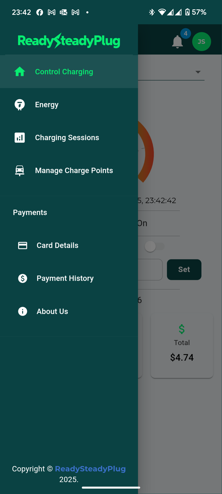
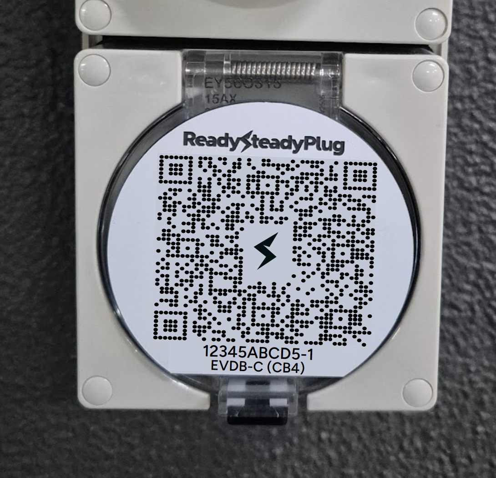
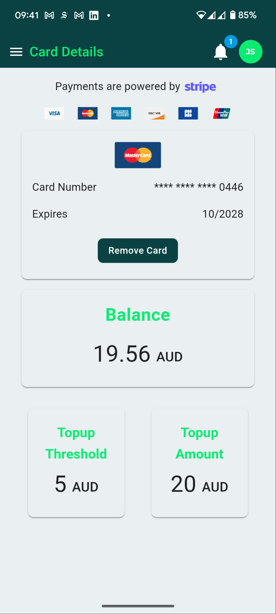
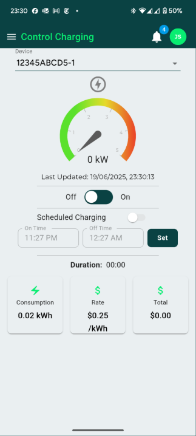
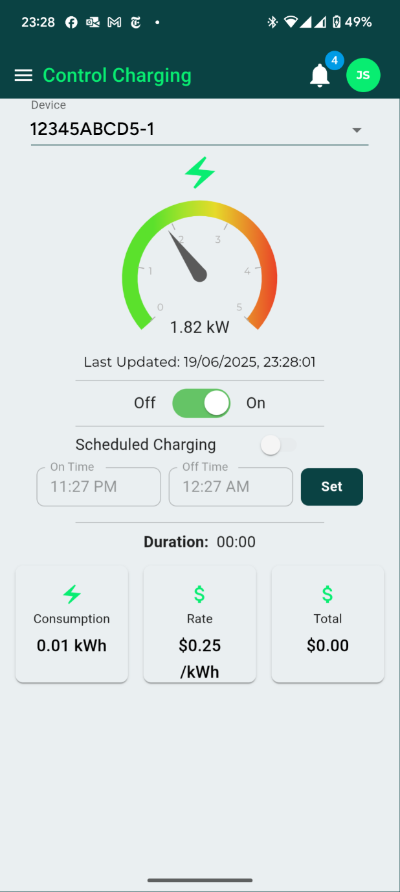

## Pairing your charge point

There are a few ways you can perform the initial pairing of your charge point.

!!! note "Note"

    Note you only need to pair your device once.  After that you can just use the RSP app to simply start/stop or schedule your charging session as per the instructions below.

### Install the RSP app
The RSP app is available for both Android and iOS and is the easiest easy to interact with your charge point, including initial pairing and starting/stopping charge sessions.

=== "iOS"
	Visit the [iOS app store](https://apple.com/au/app-store/) and search for ReadySteadyPlug

=== "Android"
	Visit [Google Play](https://play.google.com/store/apps/) and search for ReadySteadyPlug

=== "Web app"
	If you don't want to use an app, or want to access it from your computer web browser, you can access all functionality at [https://prod.readysteadyplug.com](https://prod.readysteadyplug.com).

### Main app navigation
The left hand navigation provides access to all the key functions.

{width="300"}
/// caption
Navigation Menu
///

### Initial pairing of your charge point
The easiest way is to scan the QR code on the front of the charge point, but if you don't have access to a phone with QR scanning capability, we provide an alternate method using the charge point ID code, printed under the QR code on the charge point.

{width="300"}
/// caption
Charge point with QR code and pairing ID (1234ABCD5-1)
///

=== "Scan QR Code"

    1. Point your phone camera the QR code on the front of the charge point
    2. You will be taken to the RSP sign up screen where you can create a new account using your email address or an existing Google account if you prefer.
    3. Once you have finished signing up, the system will remember the charge point ID you just scanned and assign it to your account.
    4. If you have multiple charge points and want to add another, just scan the QR code or use the "Manage Charge Points" menu item.

=== "Use charge point ID code"

    1. Visit [https://prod.readysteadyplug.com](https://prod.readysteadyplug.com)
    2. You will be taken to the RSP sign up screen where you can create a new account using your email address or an existing Google account if you prefer.
    3. Once you have finished signing up, tap the "Manage Charge Points" menu item and enter the charge point ID. In the example above, the charge point ID is **(1234ABCD5-1)**.

### Setting up billing details
To start a charge session, tap "Card Details" from the left hand navigation.

{width="300"}
/// caption
Add credit card details
///
At the end of the process your credit card is charged $20, which will be your initial balance. This is also the amount that the system automatically charges your credit card once the balance goes below $5 (similar to how E-Toll or Opal cards work.)

### Starting and stopping a charge session
Now that you have credit in your account, you can start a charging session.
Simply tap on **Control Charging** and tap the "On-Off" toggle.

{width="300"}
/// caption
Charging control - charge point turned off
///

Very quickly you will see the "dial" ramp up confirming that your charging session has commenced as follows:
{width="300"}
/// caption
Charging control - charge point turned on
///

