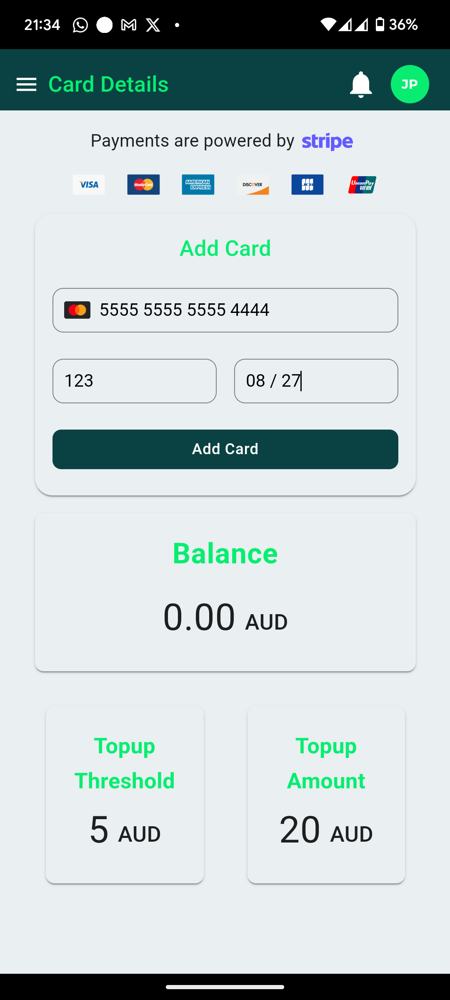
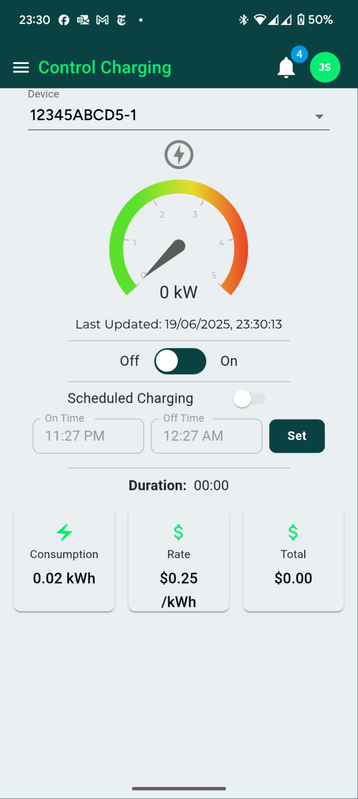

## Install the RSP app
To interact with your charge point, including initial pairing and starting/stopping charge sessions, access the RSP web app as follows. The app will be available for both Android and iOS in the near future (July 2025):  

=== "Web app"
	If you don't want to use an app, or want to access it from your computer web browser, you can access all functionality at [https://prod.readysteadyplug.com](https://prod.readysteadyplug.com).

=== "iOS (coming soon)"
	Visit the [iOS app store](https://apple.com/au/app-store/) and search for ReadySteadyPlug

=== "Android (coming soon)"
	Visit [Google Play](https://play.google.com/store/apps/) and search for ReadySteadyPlug

## Main app navigation
The left hand navigation provides access to all the key functions.

{width="300"}
/// caption
Navigation Menu
///

## Pairing your charge point

There are a few ways you can perform the initial pairing of your charge point.

!!! note "Note"

    Note you only need to pair your device once.  After that you can just use the RSP app to simply start/stop or schedule your charging session as per the instructions below.

### Initial pairing of your charge point
The easiest way is to scan the QR code on the front of the charge point, but if you don't have access to a phone with QR scanning capability, we provide an alternate method using the charge point ID code, printed under the QR code on the charge point.

{width="300"}
/// caption
Charge point with QR code and pairing ID (1234ABCD5-1)
///

=== "Scan QR Code"

    1. Point your phone camera the QR code on the front of the charge point
    2. You will be taken to the RSP sign up screen where you can create a new account using your email address or an existing Google account if you prefer.
    3. Once you have finished signing up, the system will remember the charge point ID you just scanned and assign it to your account.
    4. If you have multiple charge points and want to add another, just scan the QR code or use the "Manage Charge Points" menu item (refer image below).

=== "Use charge point ID code"

    1. Visit [https://prod.readysteadyplug.com](https://prod.readysteadyplug.com)
    2. You will be taken to the RSP sign up screen where you can create a new account using your email address or an existing Google account if you prefer.
    3. Once you have finished signing up, tap the "Manage Charge Points" menu item and enter the charge point ID (refer image below). In the example above, the charge point ID is **(1234ABCD5-1)**.

{width="300"}
/// caption
Add or remove charge points from your account
///

* Select either **Pair using Charge Point ID** or **Pair using QR Code** to add a charge point.
* Tap the "x" under **Action** to remove a charge point.

### Adding an additional charge point
If you have multiple charge points and want to add another, just scan the QR code or use the "Manage Charge Points" menu item as described inthe previous section.

### Removing a charge point
If you want to remove the charge point from your account for any reason, Tap the "x" under **Action** to remove a charge point. Note you will no longer be able to start a charging session until you re-pair.
If you want to re-add it into your account, just follow the pairing process again, as described above.

## Setting up billing details
To start a charge session, tap "Card Details" from the left hand navigation.

{width="300"}
/// caption
Add credit card details
///
At the end of the process your credit card is charged $20, which will be your initial balance. This is also the amount that the system automatically charges your credit card once the balance goes below $5 (similar to how E-Toll or Opal cards work.)

## Starting and stopping a charge session
### Manual start/stop
Now that you have credit in your account, you can start a charging session.
Simply tap on **Control Charging** and tap the "On-Off" toggle.

{width="300"}
/// caption
Charging control - charge point turned off
///

Very quickly you will see the "dial" ramp up confirming that your charging session has commenced as follows:

{width="300"}
/// caption
Charging control - charge point turned on
///

### Scheduled charging
You can schedule the start/stop of a charging session to take place at a specific time. eg to take advantage of cheaper energy costs overnight.

* Tap the **Scheduled Charging** toggle
* Set the **On-time** and **Off-time**
* Tap the **Set** button

{width="300"}
/// caption
Scheduled charging
///

## Viewing charging information
### Historical charging sessions
Tap on **Charging Sessions** in the main navigation to see your past charging sessions. Details include:

* Charge session date and time
* Duration
* Energy used (kWh)
* The applicable tariff rate
* The total cost of the charge session

{width="300"}
/// caption
Charging sessions
///

### Historical energy usage
Tap on **Energy** in the main navigation to see your historical energy usage. Details include:

* Time and date range
* Energy usage for selected time period
* Cost for selected time period

{width="300"}
/// caption
Historical energy usage
///

## Payment history
Tap on **Payment History** in the main navigation to see your past payments. Details include:

* Current balance
* Previous payments including date/time and amount.
* Any top-up events
* Whether there were any failed payments (eg credit card had expired)

{width="300"}
/// caption
Payment history
///

## Notifications & Account Details
### Notifications
The app will provide notifications when:

* A charging session has commenced
* A charging session has stopped
* A charging session has been scheduled
* Credit has been topped up

{width="300"}
/// caption
Notifications
///

### Account Details
Tap on the **Circular Icon** in the top right hand corner. This allows you to manage:

* Password
* Logout from the app

{width="300"}
/// caption
Account details
///

## More help
If you need more assistance in any way, please do not hesitate to contact us at [support@readysteadyplug.com](mailto:support@readysteadyplug.com).